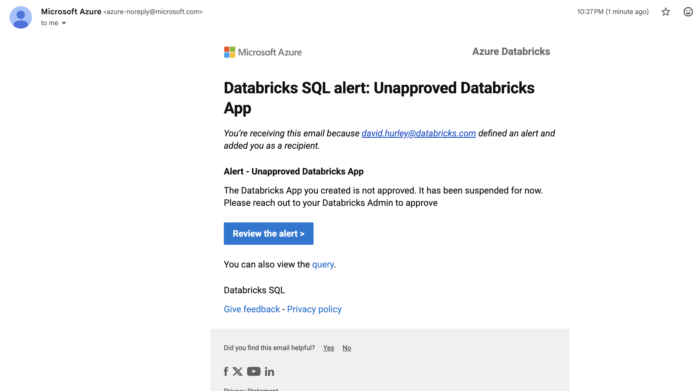

# App Compliance Manager Notebook

1. Define approved apps by app name
2. Customize email alert message that is sent to unapproved apps creators
3. Schedule notebook, alerts are sent 2min after notebook runs

Alerts dynamically update with unapproved app creator emails. 

