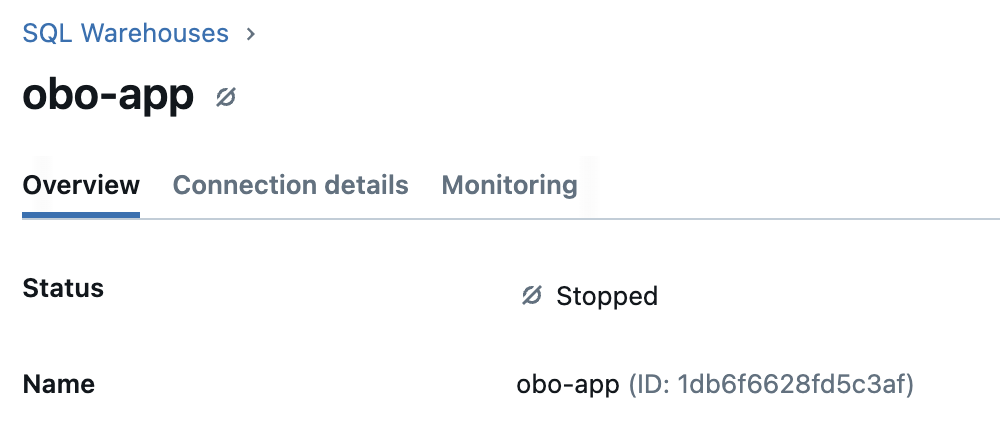

# Databricks Apps Deployment Accelerator

### Problem
Deploying custom enterprise data and AI applications can be burdensome. It often requires a person or team that is focused on application deployment, authentication, permissions, networking, and more (i.e. DevOps).

### Databricks Apps Solution
Databricks Apps provides a solution by bringing the application layer directly to the data layer, eliminating the need for complex deployment infrastructure.

Databricks Apps:
- Does not require containerizing the application
- Compute is serverless and auto-scales with demand
- App authentication and user access to data is managed via Unity Catalog (i.e. your data permissions are respected)
- You can share with anyone in your organization so long as they are in an Azure AD group (similar on AWS)
- You can deploy Python and Node.js frameworks

## Getting Started
The application development and deployment cycle can be broken into 3 stages. 
1. Develop and run the app locally
2. Deploy the app to a Databricks Dev workspace
3. Enable GitHub Actions to deploy the app to a Databricks Prod workspace

### Prerequisite 
- Need Python 3.11 --> hosted apps are pinned to 3.11
- Need the [Databricks CLI](https://docs.databricks.com/aws/en/dev-tools/cli/install]) on a local machine
- Need a GitHub account with Admin rights at the repository level
- Need a Databricks workspace that is Unity Catalog enabled with Databricks Apps feature switched on and access to SQL Warehouse compute

### Step 1: Develop Locally
1. Clone this repo and open the `dbx-apps-deployment-demo` folder, `git clone https://github.com/david-hurley/databricks-demos.git`
2. Use the Databricks CLI to setup workspace authentication

    a. If you have an existing Databricks Default configuration profile, run `databricks auth profiles` to check, if you have a profile then skip step 3. 

    b. To create a new Default or custom named configuration profile follow the [documentation](https://docs.databricks.com/aws/en/dev-tools/cli/authentication)

3. This project uses `uv` package manager, you can install with `pip install uv`
4. Once installed, you can run `source .venv/bin/activate` to launch a virtual environment. Run `python --version` and confirm 3.11
4. Install the required packages with `uv pip install -r requirements.txt`
5. Copy the SQL Warehouse compute ID from the workspace, found next to name on SQL Warehouse details and add to `app/.env` 

7. Run the Streamlit app with `streamlit run app/app.py` --> try reading some data from Unity Catalog. When this app runs locally it will use your user level auth to access data. 

### Step 2: Deploy the App to a Databricks Dev Workspace with Asset Bundles
1. Update the host url in the `databricks.yml` file
2. Now run `databricks bundle validate --var="sql_warehouse_id=383cc3b75ffe2072"` - we are dynamically passing the sql warehouse id, replace with your id
3. Now we are going to create the App resource `databricks bundle deploy --var="sql_warehouse_id=383cc3b75ffe2072"`
4. Lastly we will start the app `databricks bundle run demo-app-deploy --var="sql_warehouse_id=383cc3b75ffe2072"`, update with your app name
5. Try testing out the app in the Dev workspace, see if the authentication works by accessing a table you have access to but the app doesn't and vice versa

### Step 4: Automate App Deployment to Production
1. Add the secrets in the `deploy.yml` to your GitHub repository
2. Push the code to a GitHub branch and open a pull request
3. Merge the PR to main --> this will launch the action. Note: the GitHub runner is currenlty pointing to our field EMU GitHub which gives action permission over the E2 field eng workspace. You may need to update. 