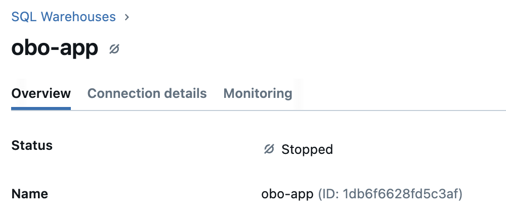

<!-- Main Title -->
# Databricks Apps Development and Deployment Accelerator

### Problem
Deploying custom enterprise data and AI applications can be burdensome. It often requires a person or team that is focused on application deployment, authentication, permissions, networking, and more (i.e. DevOps). 

The problem is this slows time to value for data and AI teams and introduces processes that require specialized knowledge. 

### Scenario
Imagine this - you are on Azure and have built a custom Python or Node.js application. Your application is simple, it is designed to give users within the orginization access to data (i.e. CRUD operations). This application runs great locally but now you need to deploy the app so that users can interact. 

In Azure, you would most likely use Azure WebApps. In this case, to deploy the application, you would need to follow roughly these steps:

1. Containerize the application code and dependencies
2. Register, version, and potentially orchestrate the container
3. Deploy the container to Azure WebApp - setup networking on app, authentication for users, permissions for users to access data outside app memory and permissions for app to write state
4. Automate deployment with GitHub Action workflows - configure GitHub runner with permissions to container registry and Azure WebApp

You can replace Azure WebApps with any plethora of app hosting services and the steps are similar or the same. 

The primary problem is that the application layer does not "live" next to the data layer. 

### Databricks Apps Solution
Databricks Apps provides a solution by bringing the application layer directly to the data layer, eliminating the need for complex deployment infrastructure.

Databricks Apps:
- Does not require containerizing the application
- Compute is serverless and auto-scales with demand
- App authentication and user access to data is managed via Unity Catalog (i.e. your data permissions are respected)
- You can share with anyone in your organization so long as they are in a Azure AD group (similar on AWS)
- You can deploy Python and Node.js frameworks

## Getting Started
The application development and deployment cycle can be broken into 3 stages. 
1. Develop and run the app locally
2. Deploy the app to a Databricks Dev workspace
3. Enable GitHub Actions to deploy the app to a Databricks Prod workspace

### Prerequisite 
- Need Python 3.9+
- Need the [Databricks CLI](https://docs.databricks.com/aws/en/dev-tools/cli/install]) on a local machine
- Need a GitHub account with Admin rights at the repository level
- Need a Databricks workspace that is Unity Catalog enabled with Databricks Apps feature switched on and access to SQL Warehouse compute

### Step 1: Develop Locally
1. Clone this repo and open the `streamlit-app-e2e-deployment` folder, `git clone https://github.com/david-hurley/databricks-demos.git`
2. Use the Databricks CLI to setup workspace authentication
    a. If you have an existing Databricks Default configuration profile, run `databricks auth profiles` to check, if you have a profile then skip step B. 
    b. To create a new Default or custom named configuration profile follow the [documentation](https://docs.databricks.com/aws/en/dev-tools/cli/authentication)
3. In the root of the repository run `source .venv/bin/activate` to launch a virtual environment
4. Install the required packages with `pip install -r app/requirements.txt`
5. Copy the SQL Warehouse compute ID from the workspace, found next to name on SQL Warehouse details 
6. Export the SQL Warehouse ID as an environment variable `export SQL_WAREHOUSE_ID=XXX`
7. Run the Streamlit app from repository root with `streamlit run app/app.py`

You should be able to read data from your Unity Catalog in the workspace

### Step 2: Test App in Databricks Dev Workspace
Now we want to deploy the app to a test workspace, for this we will leverage the Databricks Asset Bundles (DABs). This is infrastructure as code for Databricks resources.
1. In `databricks.yml` update the `sql-warehouse` id and the Dev and Production `Host` - note you can remove Production section for now if you just want to test
2. Now run `databricks bundle validate` - you should see a green check
3. Next, run `databricks bundle deploy` - this will standup the app resource but will not start. To confirm, navigate to the `compute` and `app` tab in your workspace and see if a new app was created
4. Finally, run `databricks bundle run streamlit-auth-demo` (replace `streamlit-auth-demo` with a new name you give the app) - now you should be able to view your live application in the workspace. 
5. Test out the authentication - try to query a dataset that you have access to with user auth and one you do not. Note, the app can only query data that it has been given permission to select. On the dataset you just `GRANT` permission and type in the name of the app.

### Step 3: Automate App Deployment to Databricks Prd Workspace
Now that it works locally and in a Dev workspace we want to automate the deployment
1. Open the `deploy-streamlit-app.yml` in `.github/workflows`
2. Update the runner to your runner group
3. In GitHub, you need to create 3 repository secrets. One is the workspace URL (same as in `databricks.yml`) the other is a Service Principal Client ID and Secret. You can create these by going to your workspace settings then select Identity and Access and manage Service Principals. Either create a new one or use a existing and add a secret. 
4. Now you can push your code to a GitHub branch - when you merge this to `Main` it will trigger the action and redeploy the app