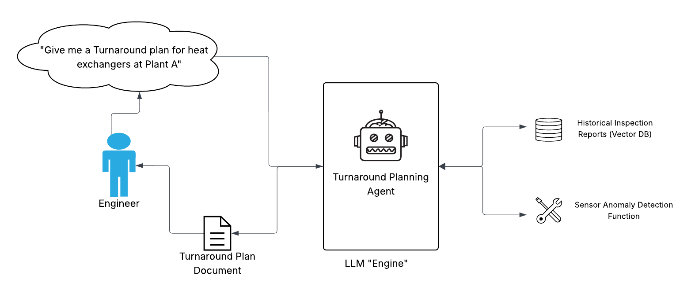

# Turnaround Solution Accelerator

### Overview

##### What is Turnaround
In industry, a turnaround refers to a planned, periodic shutdown of a plant or industrial facility to perform maintenance, inspections, repairs, and upgrades. It is a critical process aimed at ensuring safety, compliance, and operational efficiency, often involving large teams and significant logistical coordination.

##### Cost of Turnaround
Turnarounds are often the highest-cost activity because they require halting production, deploying large specialized workforces, and executing complex tasks within tight timeframes. The combination of lost revenue from downtime and high expenditures on labor, equipment, and materials drives up the overall cost significantly.

##### Cost Risks of Turnaround
The risk of cost overrun is high in turnarounds due to the complexity and unpredictability of discovering additional issues once equipment is opened or inspected. Tight schedules, dependency on contractor performance, and coordination across multiple teams amplify the chance of delays and budget escalation.

##### Cost Reduction Through Better Planning
Accurate planning before a turnaround is critical to minimize downtime and therefore reduce cost overrun. 
- Historical inspection and repair reports help identify and prioritize high-risk assets
- IoT sensor data between last turnaround and now can help highlight operating conditions which may have accelerated equipment detioration, such as temperatures above design conditions leading to increased corrosion. 

### Turnaround Agentic Planning Tool

##### Overview
This solution accelerator leverages the Databricks Mosaic AI Agent Framework to deploy a focused agent that analyzes historical inspection reports and IoT sensor data, providing engineers with data-driven recommendations for prioritizing tasks in the upcoming turnaround.

##### Architecture
The system follows this flow:
1. An engineer initiates a request for assistance in planning the upcoming Turnaround for a specific plant and piece of equipment. 

2. The AI agent is equipped with two key tools: a vector search index containing historical inspection reports and access to IoT sensor data for each asset. 

3. The agent analyzes past inspection findings and identifies recent sensor anomalies—such as unusual temperature patterns—to recommend priority areas for Turnaround planning.

### Getting Started
1. Create a Git Folder pointing to - `https://github.com/david-hurley/databricks-demos`, use sparse checkout to fetch only `turnaround-agent` folder

2. Navigate to the `turnaround-agent` folder and open `00-setup`, follow the instructions in the Notebook

3. Test the tools, system prompts, and models in the Databricks Playground
4. Export a Agent notebook template
